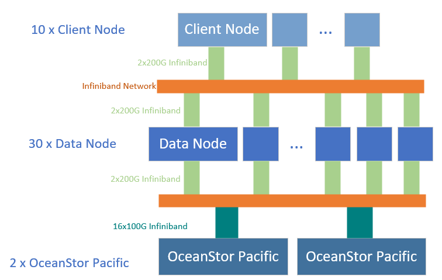
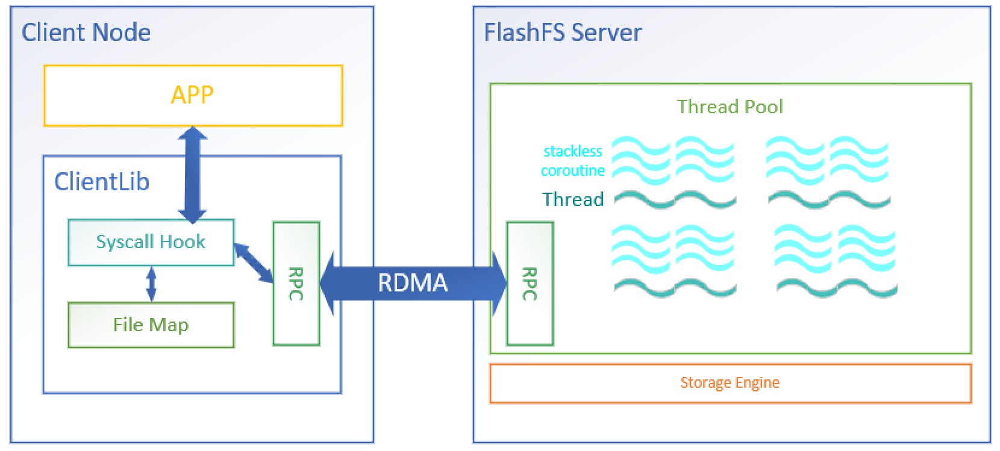
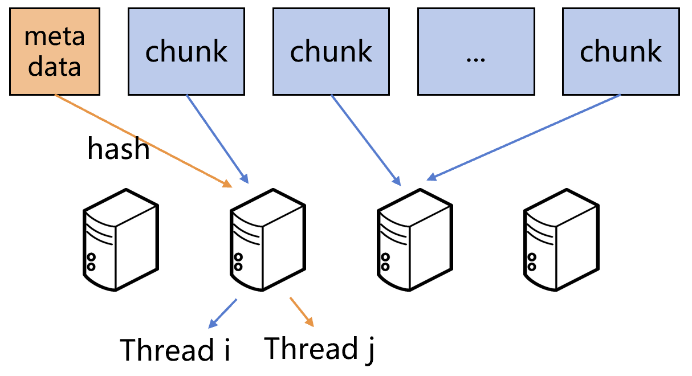
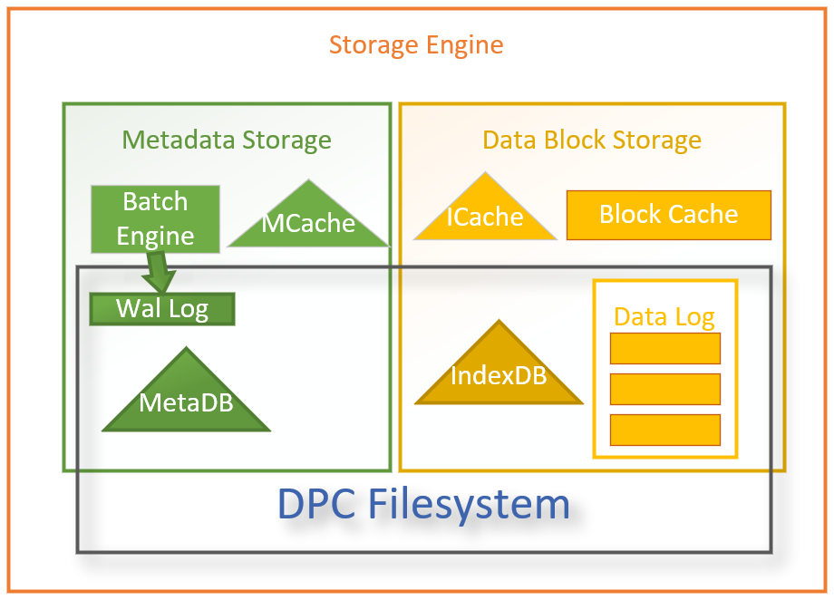
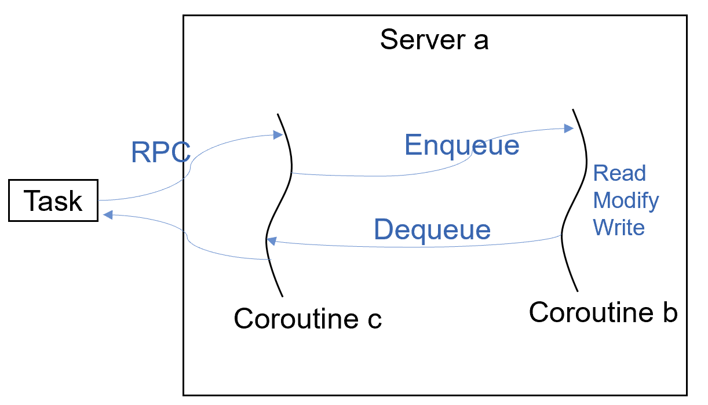
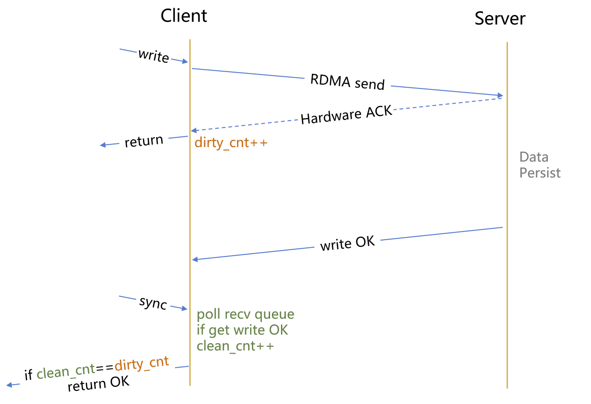

# FlashFS2 English Version

## IO500-ISC22 
Schematic diagram of the test environment:


Client node, data node test environment parameters:
| parameters             | configuration                  |
| ---------------------- | ------------------------------ |
| memory capacity        | 503G                           |
| CPU model              | Intel(R) Xeon(R) Platinum 8358 |
| CPU frequency          | 2.60GHz                        |
| sockets                | 2                              |
| cores per socket       | 32                             |
| threads per core       | 2                              |
| OS                     | Centos7                        |
| kernel version         | Linux3.10                      |
| number of client nodes | 10                             |
| number of data nodes   | 30                             |
| network                | 2x200G Infiniband              |

[OceanStor Pacific](https://e.huawei.com/cn/products/storage/distributed-storage/oceanstor-pacific-series/oceanstor-pacific-9950)：
| parameters              | configuration |
| ----------------------- | ------------- |
| capacity per OceanStor  | 188T          |
| bandwidth per OceanStor | 160GB/s       |
| count                   | 2             |


## Overview

FlashFS is a highly scalable distributed file system temporarily deployed for HPC applications. The schematic diagram of the architecture is as follows:



The overall architecture adopts the separation of client and server.
Before starting the upper-level application, each server node needs to run the background process Flash_server.

The client preloads Flash_client.so and uses [syscall_intercept](https://github.com/pmem/syscall_intercept) to intercept the file system access request of the user process. If the request is performed in the directory mounted by FlashFS, the FlashFS client will handle the execution.


## Distributed Data Management

FlashFS2 divides each file into 256KB file blocks. The data distribution of data and metadata is shown in the following figure:



File metadata is routed to a data server by hashing the absolute path of the file. The data server is responsible for accessing and persisting the metadata of the file.

The data block of the file is routed to a data server according to the hash value calculated by the absolute path of the file and the data block ID. The data server is responsible for the access and persistence of this file block.

It should be noted that in order to optimize the storage of small files (files whose file size is less than one file block), the data server where the first file block of the file is located and the data server where the file metadata is located are the same.

## RPC

FlashFS uses self-developed high-performance RPC based on two-side RDMA, which can be used on RoCE or Infiniband networks.
RDMA adopts RC connection mode, and the single-machine throughput can reach up to 11Mops in the Mellanox ConnectX-6 Infiniband network during the test.

## Stroage Engine

In the data server, each server contains up to 32 threads to process RPC requests. Each thread can create up to 1024 stackless coroutines to access the storage engine concurrently.

Each thread is bound to a Storage Engine interface, and Storage Engine interacts with [DPC filesystem](https://e.huawei.com/cn/products/storage/topic/2021/oceanstor-pacific-hpc-high-density) through libaio. The schematic diagram of the storage engine is as follows:



Components and what they do:
* Metadata Storage
    * MCache(Metadata Cache): Cache hot metadata in MetaDB.
    * Wal Log: Metadata persistence is guaranteed through Wal Log.
    * Batch Engine: Multiple Metadata can be aggregated and written to Wal Log to speed up persistence.
    * MetaDB(Metadata Database): Persistent metadata index. Generated by Wal Log asynchronous scan.
* Data Block Storage
    * Data Log: Stores data blocks of size 256KB in the form of Logs.
    * IndexDB(Index Database): Used to quickly index the data in the Data Log, which can be restored by scanning the Data Log.
    * ICache(Index Cache): Cache of IndexDB.
    * Block Cache: The cache of the Data Log, the cache block size is 256KB, which is generated when reading.

### Create (modify) file metadata
1. Create a cache in MCache while passing metadata to Batch Engine.
2. When the Batch Engine collects a certain amount of metadata or triggers a timeout mechanism, the metadata is written to the Wal Log.
3. The client is notified via RPC that the file creation (metadata modification) is complete.
4. Wal Log is applied to MetaDB asynchronously.
### Get file metadata
1. First get the metadata from MCache, if the cache hits, return the file metadata information through RPC.
2. If the cache misses, access MetaDB to obtain metadata, and return file metadata information through RPC.
### Write file block
1. File data is written to Data Log
2. Create a Data Log index in ICache and return client ACK via RPC.
3. ICache content is asynchronously flushed into IndexDB.
### Read file block
1. Get the Data Log index from ICache. If there is a cache miss, the Data Log index is fetched from IndexDB.
2. Read the file blocks from the Data Log according to the index information, and create the corresponding file block cache in the Block Cache.
3. Return data from the Block Cache to the client via RPC.

## Concurrency control

In order to reduce the overhead of locking, FlashFS performs metadata operations on the same file by the same thread. The schematic diagram is as follows:


Take file A as an example:
* Server_ID = a = hash1(file-name) % Server_Num
* Thread_ID = b = hash2(file-num) % Thread_Num

Metadata modification requests for file A need to be processed by thread *b* on Data Server *a*.

If thread *c* receives a modification request for file A, *c* will forward the request to the coroutine on thread *b* for processing.

Through the above request transfer operation, the serialization of the metadata modification of file A is guaranteed.

Concurrency control is also accomplished in a similar manner for the write operation of the data block of file A.

## write-fsync

To improve the write performance of FlashFS, FlashFS optimizes the write-fsync combined operation. As shown below:



After each write request is sent through RPC, it will return to the client that the write is successful. After the data server completes the data persistence, it returns an ACK to the client, which is asynchronously received by the client's RDMA network card hardware. When the client performs fsync on a file, it is determined whether the data persistence is completed by comparing the number of ACKs received by the client and the execution times of the write request. After all the data is persisted, fsync returns.

## Configure and run

To run the program, you need to configure `/etc/flashfs/cfg.json` first. The configuration parameters are described as follows:
```
{
    // FlashFS cluster master node IP address
    "master-ip": "n30311",
    // RPC port of the master node of the FlashFS cluster
    "master-port": 8989,
    // RPC port for FlashFS data nodes
    "server-port": 8990,
    // RDMA RoCE gid-idx
    "gid-idx": 1,
    // Maximum number of supported clients
    "max-cli-num": 10000,
    // List of data server nodes ip/hostname
    "server-list": [
        "n30321",
        "n30322",
        "n30324",
        "n30325"
    ],
    // List of RDMA device names
    "dev-list": [
        "mlx5_0",
        "mlx5_1"
    ],
    // Database data storage path(MetaDB, IndexDB)
    "db-path": [
        "/mnt/dpc1",
        "/mnt/dpc2",
    ],
    // Available core masks
    "core-mask": "000ffffffff",
    // Number of threads in the data server-side thread pool
    "io-num": 32,
    // FlashFS mount point
    "mount-point": "/mnt/flashfs",
    // Data Log storage path
    "data-path": [
        "/mnt/dpc1",
        "/mnt/dpc2",
    ],
    // Used to configure the interval for reporting cluster status information
    "master-report-sec": 1,
    // Hugepage file system mount point
    "hugetlbfs-dir": "/mnt/huge",
    // Timeout of Batch Engine
    "wal-sync-timeout-us": 20,
}
```

Program running steps:
1. Start the Master node by executing `sh run.sh master`
2. Start the server node by executing `sh run.sh server` on the data server
3. Execute the upper application


# FlashFS2 中文版

## IO500-ISC22 中文版
测试环境示意图：


客户端节点、数据服务器测试环境参数：
| 属性           | 配置                           |
| -------------- | ------------------------------ |
| 内存容量       | 503G                           |
| CPU型号        | Intel(R) Xeon(R) Platinum 8358 |
| CPU频率        | 2.60GHz                        |
| CPU槽数        | 2                              |
| 每槽核数       | 32                             |
| 每核线程数     | 2                              |
| 操作系统       | Centos7                        |
| 内核版本       | Linux3.10                      |
| 客户端数量     | 10                             |
| 数据服务器数量 | 30                             |
| 网络           | 2x200G Infiniband              |

[OceanStor Pacific](https://e.huawei.com/cn/products/storage/distributed-storage/oceanstor-pacific-series/oceanstor-pacific-9950)参数：

| 属性     | 参数    |
| -------- | ------- |
| 容量每台 | 188T    |
| 带宽每台 | 160GB/s |
| 个数     | 2       |


## 整体架构

FlashFS是一个针对HPC应用程序临时部署的，高度可扩展的分布式文件系统。架构示意图如下：


整体架构采用客户端和服务端分离。
在启动上层应用程序之前，每个服务端节点都需要运行文件系统的后台进程Flash_server。

客户端通过预加载（Preload）Flash_client.so，调用
[syscall_intercept](https://github.com/pmem/syscall_intercept)拦截用户进程的文件系统访问请求。如果该请求在FlashFS所挂载的目录下执行操作，则将有FlashFS客户端处理执行。

## 数据分布

FlashFS2将每个文件切分成一个个大小为256KB的文件块。数据和元数据的数据分布如下图所示：


文件元数据通过计算文件绝对路径的哈希值，路由到一台数据服务器上。由该数据服务器负责该文件元数据的访问与持久化。

文件的数据块则是根据文件绝对路径和数据块ID共同计算出的哈希值，路由到一台数据服务器上。该数据服务器负责这个文件块的访问与持久化。

需要注意的是为了优化小文件存储（文件大小小于一个文件块的文件），文件的第一个文件块所在的数据服务器和文件元数据所在的数据服务器是同一台。

## RPC

FlashFS使用自研的基于双边RDMA实现的高性能RPC，可搭建在RoCE或者Infiniband网络上。
RDMA采用RC连接模式，测试时在Mellanox ConnectX-6 Infiniband网络中单机吞吐最高可达11Mops。

## 存储引擎

在数据服务器，每个服务器都包含最多32个线程用来处理访问请求。每个线程最多可以创建1024个无栈协程来并发处理访问请求。
每个线程和一个存储引擎（Storage Engine）接口绑定，Storage Engine通过libaio同[DPC Filesystem](https://e.huawei.com/cn/products/storage/topic/2021/oceanstor-pacific-hpc-high-density)进行交互。存储引擎的示意图如下：


组件与作用：
* Metadata Storage
    * MCache（元数据缓存）：缓存MetaDB中的热元数据。
    * Wal Log（写前日志）：通过Wal Log保证元数据持久化。
    * Batch Engine（批处理引擎）：可以聚合多个Metadata写入Wal Log，加速持久化。
    * MetaDB（元数据数据库）：元数据持久化引擎。由Wal Log异步刷入生成。
* Data Block Storage
    * Data Log（数据日志）：以Log的形式存储大小为256KB的数据块。
    * IndexDB（索引数据库）：用来索引Data Log中数据，可以通过Data Log还原。
    * ICache（索引缓存）：IndexDB的缓存。
    * Block Cache（块缓存）：Data Log的缓存，缓存块大小为256KB，在读取时生成。

### 创建（修改）文件元数据
1. 在MCache创建缓存，同时将元数据传递给Batch Engine。
2. 当Batch Engine收集元数据达到批处理数量或者触发超时机制时，将元数据写入Wal Log。
3. 调用RPC通知客户端文件创建（元数据修改）完成。
4. Wal Log异步应用到MetaDB。
### 读取文件元数据
1. 访问MCache，如果缓存命中，返回文件元数据信息。
2. 如果缓存未命中，访问MetaDB，并返回文件元数据信息。
### 写入文件数据
1. 文件数据写入Data Log
2. 在ICache创建Data Log索引，返回客户端ACK。
3. ICache内容异步刷入IndexDB。
### 读取文件数据
1. 从ICache获取文件索引数据。如果缓存未命中，则从IndexDB获取Data Log索引。
2. 根据索引信息读取Data Log，在Block Cache中创建缓存。
3. 从Block Cache中返回数据给客户端。

## 并发控制
为了减少锁的开销，FlashFS对于同一个文件的元数据操作都由同一个线程执行。示意图如下：

对于文件A来说：
* Server_ID = a = hash1(file-name) % Server_Num
* Thread_ID = b = hash2(file-num) % Thread_Num

如果线程c收到了对文件A的修改请求，C将会把请求转交给线程b上的协程来处理。

通过上述的请求转移操作，保证了文件A的元数据修改序列化。

对于文件A的数据块的写入操作也使用类似的方式完成并发控制。

## write-fsync

为了提升FlashFS的写入性能，FlashFS优化了write-fsync组合操作。如下图所示：


每次write请求发送完成之后便返回客户端写入成功。数据服务端完成数据持久化之后返回Write OK，由客户端RDMA网卡硬件异步接收。在客户端对某文件执fsync时，通过比较客户端所有到的write OK个数和write请求的执行次数是否相同，来判断是否完成数据的持久化。等到数据全部持久化完毕之后，fsync执行返回。

## 运行

程序运行需要配置`/etc/flashfs/cfg.json`。配置参数说明如下：
```
{
    // FlashFS集群主节点IP地址
    "master-ip": "n30311",
    // FlashFS集群主节点的RPC端口
    "master-port": 8989,
    // FlashFS数据节点的RPC端口
    "server-port": 8990,
    // RDMA RoCE gid-idx
    "gid-idx": 1,
    // 最大支持的客户端数量
    "max-cli-num": 10000,
    // 数据服务端节点的列表ip/hostname
    "server-list": [
        "n30321",
        "n30322",
        "n30324",
        "n30325"
    ],
    // RDMA设备名称列表
    "dev-list": [
        "mlx5_0",
        "mlx5_1"
    ],
    // 数据库数据路径
    "db-path": [
        "/mnt/dpc1",
        "/mnt/dpc2",
    ],
    // 可用的核心掩码
    "core-mask": "000ffffffff",
    // 数据服务器端线程池中线程数量
    "io-num": 32,
    // FlashFS挂载路径
    "mount-point": "/mnt/flashfs",
    // Data Log存储路径
    "data-path": [
        "/mnt/dpc1",
        "/mnt/dpc2",
    ],
    // 用于信息收集统计的时间间隔
    "master-report-sec": 1,
    // 大页文件系统挂载目录
    "hugetlbfs-dir": "/mnt/huge",
    // Batch Engine的超时时间
    "wal-sync-timeout-us": 20,
}
```

程序运行步骤：
1. 启动Master节点，执行`sh run.sh master`
2. 启动服务端节点，在数据服务器执行`sh run.sh server`
3. 执行应用程序


## 交流

邮箱：yhm12345@foxmail.com

QQ群组：724071725